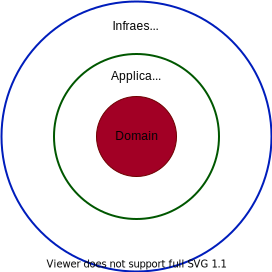

  <!-- Todo docker file -->

# Golang Ceibablock 


## Description
This block is an adaptation of the NodeJS-NestJS block, this block uses libraries such as GinGonic, GinSwagger, Gorm for the main functionalities.
This block was developed implementing desing patterns(Dao, Repository, Singleton, CQRS, Dependency injection etc..) and a clean architecture (hex architecture) .


## Architecture (Hexagonal)
The hex arxhiture allows to segregate the aplication in 3 tiers, that can comunicate in one direction, with this in mind, the 3 tiers of this architecture are **infraestructure**, **application** and **domain**.



- **Infraestructure**: Has the responsability of interact directly with the outputs and inputs of the system also do the adaptors to the ports defined in the domain layer. Examples of this layer can be expose web services, connect to databases, read task queues, etc.
- **Application**: Layer in charge of routing incoming events from the infrastructure layer to the domain layer, it is generally known as a transactional barrier which groups all the invocation of a use case, patterns such as Factories, Command Handlers, events, etc.
- **Domain**: Represents all the business logic of the application which is the reason for the business to exist. It try to avoid the [Anemic anti pattern](https://martinfowler.com/bliki/AnemicDomainModel.html) and suport the [Tell dont ask principle](https://martinfowler.com/bliki/TellDontAsk.html). In this layer you can find the following aggregate patterns, domain services, entities, value objects, repositories (port), etc.

To obtain more documentation on this type of architecture, it is recommended to read about [Hexagonal architecture and DDD](https://codely.tv/blog/screencasts/arquitectura-hexagonal-ddd/)


## Technical especifications
- [GinGonic](https://github.com/gin-gonic/gin) Is used as the network framework.
- [Gorm](https://gorm.io/index.html) Is udes as the ORM of the application, it has a migration system.
- [Ginkgo](https://onsi.github.io/ginkgo/), [Gomega](https://onsi.github.io/gomega/) and [Gomock](https://github.com/golang/mock) Are used as the testing framework.
- [GinSwagger](https://github.com/swaggo/gin-swagger) Is used to generate documentation of the API.
- [GoDotEnv](https://pkg.go.dev/github.com/joho/godotenv) Is used to manage the environment variables.


## Testing
For testing are used three libraries:
- [Ginkgo](https://onsi.github.io/ginkgo/): for structure, before and after functions 
- [Gomega](https://onsi.github.io/gomega/): for spects structure and implementation
- [Gomock](https://github.com/golang/mock): for mocking thinks like receiver functions or structs
### Get started
- ``` $ go get github.com/onsi/ginkgo/v2/ginkgo ```
- ``` $ go get github.com/onsi/gomega/ ```
- ``` $ go install github.com/golang/mock/mockgen@v1.6.0 ```
- Install the cli of ginkgo by running the command: ``` $ go install github.com/onsi/ginkgo/ginkgo  ```
- for test all suites you can use the following command
```
$ ginkgo -r
```
- for run only one suite of test you have to run the following commnd on the file directory: 
```
$ ginkgo 
``` 


## Migrations
To run a migration you have to run the following command: 
```
$ go run ./src/infraestructure/migrations/migrate.go 
```
[See more in the docs](https://gorm.io/docs/migration.html) 


## Documentation (GinSwagger)
For the documentation is used the package GinSwagger, this generates a file whisch is loaded into an application path, for example, if your APPLICATION_PORT is :8080 and your CONTEXT_PATH is api/v1, your documentation should be on the route http://localhost:8080/api/v1/swagger/index.html, once the application has been initialized [See more in the docs](https://github.com/swaggo/gin-swagger).


## Run
For run the app, you have two ways, run it with a environment or without it (this does'n means that there isn't an environment).
If you want to run the app in development mode, use:
```
$ go run ./src/main.go
```
If you want to run teh app wit a enviroment, use:
```
$ ENVIRONMENT=<production | test> go run ./src/main.go
```